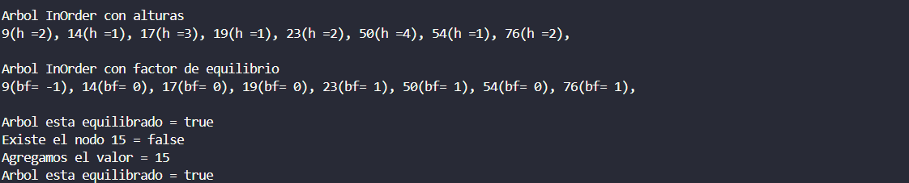

# PL-Métodos de Búsqueda Binaria (Trabajo individual)

## 📌 Información General
- **Título:** PL - Métodos de Búsqueda Binaria
- **Asignatura:** Estructura de Datos
- **Carrera:** Computación
- **Estudiante:** Pablo Esteban Escandón Lema
- **Fecha:** 19 de abril de 2025
- **Profesor:** Ing. Pablo Torres

---
---
## 🛠️ Descripción

El proyecto implementa un Árbol Binario de Búsqueda (ABB), permitiendo:
- Insertar elementos de manera ordenada.
- Visualizar el árbol en diferentes recorridos: InOrder, PreOrder y PostOrder.
- Verificar la existencia de un nodo.
- Calcular la altura del árbol.
- Calcular el peso del árbol (cantidad de nodos).
- Imprimir el árbol mostrando la altura de cada nodo.
- Imprimir el árbol con el factor de equilibrio de cada nodo.
- Verificar si el árbol se encuentra equilibrado.

Además, el árbol se construye dinámicamente y puede incluir verificación de balance en tiempo real tras la inserción de nuevos elementos.

---
---
## 🧑‍💻 Ejemplo de Ejecución

```plaintext
Peso del arbol= 8
Altura es = 4

Arbol InOrder
9, 14, 17, 19, 23, 50, 54, 76,

Arbol InOrder con alturas
9(h =2), 14(h =1), 17(h =3), 19(h =1), 23(h =2), 50(h =4), 54(h =1), 76(h =2), 

Arbol InOrder con factor de equilibrio
9(bf= -1), 14(bf= 0), 17(bf= 1), 19(bf= 0), 23(bf= 0), 50(bf= 2), 54(bf= 0), 76(bf= 0), 

Arbol esta equilibrado = true

Existe el nodo 15 = false
Agregamos el valor = 15
Arbol esta equilibrado = false



